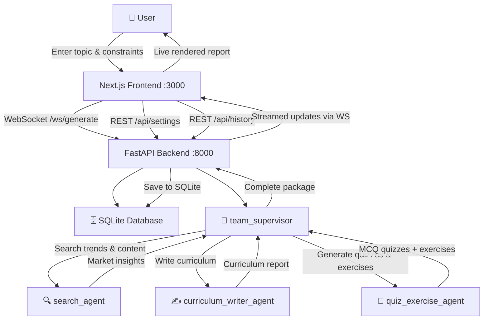

# 🧠 EduGraph — Multi-Agent AI Curriculum & Course Generator

EduGraph is a state-of-the-art, production-ready educational content design platform. It leverages a team of cooperative, specialized AI agents orchestrated via **LangGraph** to research, structure, write, and enrich course curricula in real time. 

The system operates in a single, comprehensive generation pipeline:
*   **Generate Mode**: Supply a new topic (e.g. "Generative AI", "Quantum Computing Foundations") along with target duration and audience parameters. The specialized agent team performs web research via Tavily Search, designs modular outlines, drafts comprehensive lesson materials, and generates interactive MCQ quizzes and hands-on coding challenges from scratch.

---

## 🏗️ Architecture Overview



---

## 🤖 Agent System — Detailed Breakdown

### 1. `team_supervisor` (Orchestrator)
*   **Role**: Orchestrates flow, parses user query parameters, manages agent routing sequence, compiles outputs.
*   **Decision Strategy**: The supervisor uses structured output tool-calling (`create_supervisor` under `langgraph_supervisor`) to decide whether to invoke the next agent or finish based on the current messages log state.
*   **Prompt**:
    ```
    You are the team supervisor for EduGraph, an AI-powered curriculum generation system.
    Your team consists of 3 specialized agents: search_agent, curriculum_writer_agent, quiz_exercise_agent.
    Route requests in exact sequence and compile findings to output.
    ```

### 2. `search_agent`
*   **Role**: Conducts web research to fetch real-world skill requirements and trending frameworks.
*   **Tools**: `TavilySearch` (configured dynamically using settings API keys).
*   **Input**: Syllabus topics or generation topic.
*   **Output**: Multi-page styled web search summary documenting skills gaps and industry tooling standard replacements.

### 3. `curriculum_writer_agent`
*   **Role**: Crafts academic lesson plans, timelines, recommended resource reading, and objectives.
*   **Tools**: None (pure LLM reasoning).
*   **Input**: Search reports.
*   **Output**: Markdown document containing Course outline, lesson timings, and academic modules.

### 4. `quiz_exercise_agent`
*   **Role**: Designs interactive learning materials (MCQ questions with explanations) and progressive coding challenges.
*   **Tools**: None (pure LLM JSON parser).
*   **Input**: Finalized Markdown curriculum document.
*   **Output**: Strictly structured JSON payload matching the requested module quizzes and exercises format.

---

## 📡 Communication, Coordination & State

All agents coordinate in LangGraph by contributing to a shared state (`MessagesState`), which is a chronologically ordered list of message exchanges:
1.  **Context Flow**: Agent outcomes are appended as consecutive `AIMessage` formats. Any subsequent agent automatically reviews preceding agent logs.
2.  **Supervisor Handoff**: Rather than strict hardcoded routes, the supervisor invokes agent execution using custom-built transfer tools generated automatically by `create_supervisor`.

---

## 🛠️ Tools Documentation

### `TavilySearch`
*   **Signature**: Dynamically generated via factory `create_tavily_tool(api_key: str)`
*   **Operation**: Queries the Tavily Search API with `max_results=5` and `topic="general"`.

---

## 🗄️ Database Schema

SQLite schema contains two tables:

### `settings`
Holds key credentials. Multi-user isolation is maintained by locking down writing edits inside a single-row constraint.
```sql
CREATE TABLE settings (
    id INTEGER PRIMARY KEY DEFAULT 1 CHECK (id = 1),
    google_api_key TEXT,
    tavily_api_key TEXT,
    default_model TEXT DEFAULT 'gemini-3.1-flash-lite',
    updated_at TIMESTAMP DEFAULT CURRENT_TIMESTAMP
);
```

### `generations`
Acts as local history storage of generation details.
```sql
CREATE TABLE generations (
    id TEXT PRIMARY KEY,
    title TEXT NOT NULL,
    mode TEXT NOT NULL,
    input_data TEXT NOT NULL,
    curriculum_report TEXT,
    quizzes_data TEXT,
    search_results TEXT,
    status TEXT DEFAULT 'processing',
    error_message TEXT,
    created_at TIMESTAMP DEFAULT CURRENT_TIMESTAMP,
    completed_at TIMESTAMP
);
```

---

## 🚀 Setup & Installation

Follow these quick commands to set up the system on your local machine:

### 1. Prerequisite Environments
*   **Node.js**: v18.0.0 or higher (v24 recommended)
*   **Python**: v3.10 or higher

### 2. Backend Setup
```bash
# Navigate to backend and install python dependencies
cd backend
pip install -r requirements.txt

# Run FastAPI backend server (listens on localhost:8000)
python run.py
```

### 3. Frontend Setup
```bash
# Navigate to frontend and install node packages
cd ../frontend
npm install

# Run dev Next.js server (listens on localhost:3000)
npm run dev
```

### 3.5 Docker & Docker Compose Setup

Alternatively, you can build and start the entire stack simultaneously in isolated containers using Docker and Docker Compose:

```bash
# Start both backend and frontend services in the background
docker compose up --build -d

# Check status of containers
docker compose ps

# View real-time log outputs
docker compose logs -f
```

The database SQLite file (`backend/edugraph.db`) is mapped locally to your host directory via volume mounting, meaning all your settings, API keys, and curriculum history are safely persisted on your host machine outside the containers.

### 4. Configuration
1. Open your browser and navigate to `http://localhost:3000`.
2. The setup guard automatically intercepts and redirects you to `/settings`.
3. Input your **Google AI Studio API Key** (acquired free from [aistudio.google.com](https://aistudio.google.com)) and **Tavily Search API Key** (acquired free from [tavily.com](https://tavily.com)).
4. Click **Save Configurations** and return to Generate page to launch!

---

## 📂 Project Directory Structure

```
.
├── backend/
│   ├── app/
│   │   ├── agents/            # Multi-agent graph setups & prompts (search, writer, assessment)
│   │   ├── routes/            # FastAPI settings, log CRUD, and websockets
│   │   ├── tools/             # Tavily tools
│   │   ├── config.py
│   │   ├── database.py        # SQLAlchemy async setup
│   │   ├── models.py          # SQLite model mappings
│   │   └── main.py            # CORS middlewares and subroutes
│   ├── requirements.txt
│   └── run.py
│
└── frontend/
    ├── src/
    │   ├── app/
    │   │   ├── history/       # Generation log list & review page
    │   │   ├── settings/      # Credential configuration page
    │   │   ├── globals.css    # Sleek 2026 SaaS Light Mode styling system
    │   │   ├── layout.js
    │   │   └── page.js        # Form input, agent stepper, and modules report container
    │   ├── components/        # Modulized accordion, quiz & progress stepper widgets
    │   └── lib/
    │       └── api.js         # WebSocket and REST request interfaces
    ├── package.json
    └── next.config.js
```
